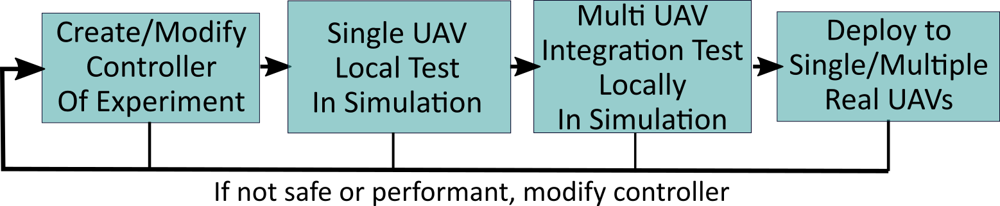

# Starling Tutorial

[TOC]

## Introduction

### What is Starling

Starling is an end to end, modular, containerised UAV infrastucture  designed to facilitate the local development, testing and deployment of Single and Multi-UAV systems from simulation to the Bristol Robotics Lab Flight Arena (and hopefully beyond). It will hopefully allow for a more approachable development workflow to enable more researchers to fly UAVs in a safe, reproducable and controllable manner.

This tutorial is intended to demonstrate how to use Starling to develop and deploy a multi-uav controller.

### What Will I learn In This Tutorial

In this tutorial you will

### The Tutorial Task Scenario

You have been asked to prototype a particular scene within a drone display!

In this scene a number of drones take off and automatically fly to starting points equidistant around a circle of a given radius. They then start circling around the edge of the circle attempting to stay equidistant to their neighbours. It is determined that the vehicles have not been well tuned and can end up lagging, therefore a centralised server monitors all the vehicles and notifies them if they are lagging behind.

## How To Use This Tutorial

This tutorial

## Contents
