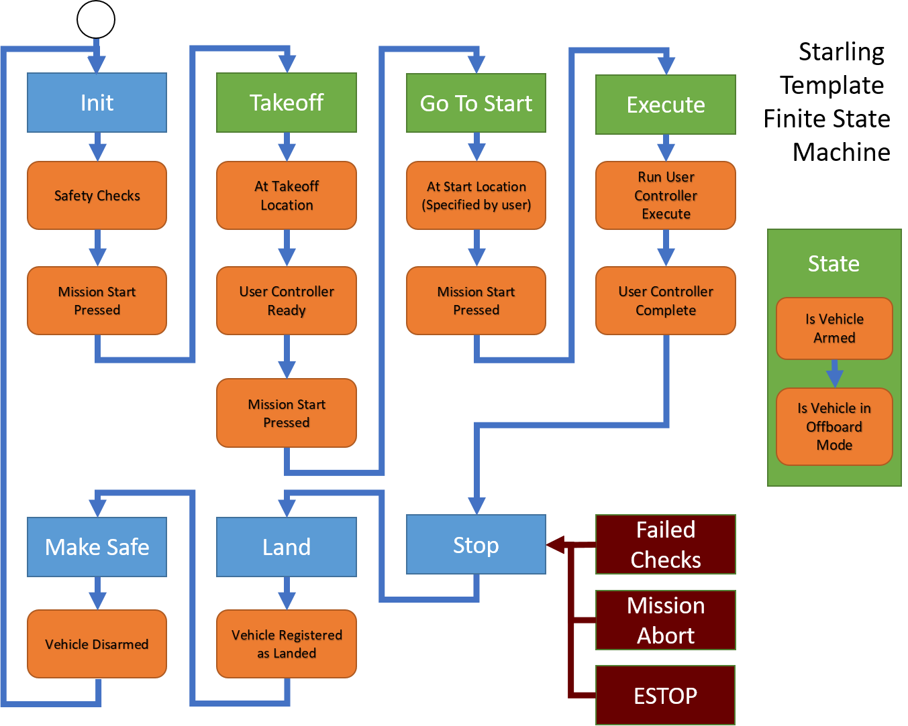

# Developing the example controller with ROS2 in CPP

Finally, the bit you have all been waiting for! In this tutorial, we will take you through how to develop and build the controller for the example scenario. This page is for the CPP controller in particular. By the end, you should have a controller ready for testing.

[TOC]


## Very Very Quick Intro to CPP

By the time of the launch of this tutorial, we may not have an equivalent tutorial in Python. Therefore we provide a very very very quick intro to the bits of CPP you need to know about for this tutorial. We recommend you check out online tutorials on CPP for a much more complete introduction! So in no particular order:

CPP is an Object Orientated-ish Language, so we have the idea of *Classes* which contain member variables and member functions. We also have the concept of inheritance, where a child class inherits the functionality and variables from its parent class. In ROS2, every `rosnode` class inherits from the `rclcpp` (ROS CPP Library) Node class.

```cpp
class UAVController : public rclcpp::Node
{
    public:
        UAVController();
        void reset();
    private:
        std::string vehicle_id = "vehicle_1";
}
```

In CPP, it is standard practice to split the *declaration* of functions and variables from the *implementation* of those same functions and variables into separate files. Reasons includes space saving, verboseness and other things - look it up.

Header files (files with extension `.h` / `.hpp`) contain all of the class and function declarations, like the example shown above. The syntax for a function declaration is `<return type> <function_name>(<function arguments>);`. The syntax to create a variable is `<variable type> variable_name;`, and can either be immediately assigned to or assigned later. Note that CPP is *typed*, which means that all functions and variables must specify what they intend to take as argument, return or be explictly (unlike Python).

Source files (files with extension `.h` / `.cpp`) contain the implementation of the class and functions which have been declared in the assocated header file (imported with `#include <header.hpp>`). The following shows the implementation of the reset function in the source file, corresponding to the class in the header. Within the implementation, class variables can be used by accessing the `this` variable. Note that instead of a `.`, an arrow `->` is used. An arrow is needed to access anything which is of a pointer type `sth_ptr` (the `this` variable is a pointer to itself). This should be enough for now - read up for much more detail).

```cpp
void UAVController::reset(){
    // ... some implementation
    this->vehicle_id = "default_vehicle_name";
}
```

As with most languages, CPP has the standard control flow operations - `if`, `for`, `while`, `continue`, `return`, etc that you would see in most other languages. Hopefully you can infer how these and the various other CPP elements work from reading the code! Good luck! :D

## Overview of the Controller Template

> **_Important:_**  Have the code open in your editor of choice and follow along with the explanation.

Let's start by examining the CPP onboard controller in more detail. As shown in the [creating a starling project tutorial](creating.md), the CPP onboard controller has the following structure:

```tree
|-- CMakeLists.txt
|-- include
|   |-- controller.hpp
|   |-- main.hpp
|   `-- state.hpp
|-- launch
|   `-- template_cpp_node.launch.xml
|-- package.xml
`-- src
    |-- controller.cpp
    `-- main.cpp
```

We gave an overview there, but we didn't provide any details on what exactly the CPP files are doing! So we now go into more detail.

### Controller Core Functionality

In addition to performing the application, this controller must take care of a number of normal functions before and after executing the actions of the application. This includes the following actions:

- Ensuring and checking that the vehicle is receiving telemetry
- Arming and Disarming the Vehicle before and after flight
- Taking off from the ground and Landing safely
- Going to the start location of the given task
- Taking instruction (such as go, abort and estop) and safely reacting to them from users

The order and usage of these actions are fairly consistent over a large number of possible applications, so this controller bundles them up as standard functionality available in the main execution of the node.

The `main.hpp` and `main.cpp` files define a `UAVController` rosnode class. In this class, after initialisation, a timer is used to run a main operating loop function over and over at a fixed interval (10hz by default). Our controller makes use of a *finite state machine* model to manage the control flow through the various states mentioned above. This FSM is shown in the diagram below.



The Rectangular boxes (apart from the red ones) all depict States of this FSM. Each state requires a number of orange actions to complete or checks to pass before it can move onto the next state. The green states also include live checks for if the vehicle is armed and in the correct mode for offboard flight, as the vehicle will be in the air. The FSM also contains failure states for any of the checks in which the vehicle which go to Stop, and therefore immediately land.

The functionality of this state machine is encoded within the `stateMachine(Time stamp)` function, and is triggered by a Ros Timer running at 10hz (`this->execution_timer`). The States are defined in `state.hpp`.

From an implementation standpoint, since the state machine has to run continuously, any called function cannot internally loop indefinitely and must execute and immediately exit. Traditionally FSMs switch states through the use of a large set of binary variables. In this particular application, this felt very verbose, and so we use boolean returning execution functions as our state machine checks.

For example, the Takeoff check calls to see whether `this->smTakeoffVehicle(stamp)` (main.cpp:246) returns true.

```cpp
case State::TAKEOFF:
    this->smOffboardArmed(stamp);
    if(!this->smTakeoffVehicle(stamp)) {
        RCLCPP_INFO(this->get_logger(), "Waiting for Takeoff");
    }
```

However, if we look at this function, it itself performs the takeoff procedure to a given height, always returning false, unless the vehicle is at its takeoff location.

### Controller Communication with MAVROS

Now we have the controller architecture in play, how does this controller actually talk to the vehicle? At the bottom of `main.hpp` you should see a whole bunch of Ros Publishers and Subscribers being declared (note how they are pointers). These pubs and subs are initialised within the class constructor/initialiser in `main.cpp:67-97`.

In order to detect arming and mode, we subscribe to `mavros/state`, and in order to get the local cartesian position and orientation of the vehicle, we also get `mavros/local_position/pose`. These both give us a constant stream of data which we save into variables `this->vehicle_state` and `this->vehicle_local_position`.

In order to send position commands to the vehicle, we set up a publisher to `mavros/setpoint_position/local` and use the `sendSetpointPositionPose(stamp, geometry_msgs::msg::PoseStamped)` function to publish setpoints to the autopilot. The translated MAVLINK commands then tell the drone to go to that location and orientation immediately.

Therefore in a number of places, we make use of interpolators to ensure that the vehicle can move from its location to any other at safe velocities and rates. Otherwise, the drone will ramp up to maximum velocity to go to far away locations which can be quite dangerous! Hence the [CD3 interpolate library](https://github.com/CD3/libInterpolate) is included by default.

### Controller User Implemented Functionality

In creating this template, it was our intention to make the user developer experience as pleasant as possible. As mentioned, we found that different applications only differed in use case, and still shared the majority of drone functionality. In our state machine then, this corresponds to only executing application based at initialisation and during the execute state.

We therefore decided to abstract this out into its own class of `UserController` within `trajectory.hpp` and `trajectory.cpp`.

```cpp
class UserController
{
    public:
        UserController(UAVController *node);

        // Reset this controller
        void reset();

        // User Controller Checking If The Start Location is Registered
        bool smReady(const rclcpp::Time& stamp);

        // User Controller Execute One Control Loop
        bool smExecute(const rclcpp::Time& stamp, const rclcpp::Duration& time_elapsed);

    private:
        // ROS Helper Functions
        rclcpp::Logger get_logger();
        rclcpp::Time now();

        // The ROSnode itself
        UAVController* node;

        // User variables
        ...
}
```

The `UserController` only has 3 functions of `reset()`, `smReady(stamp)` and `smExecute(stamp, time_elapsed)` which correspond with the parts of the State Machine which are important to the user. The other important variable is the `node`. This class is *not* a node in itself (a node cannot run another node). This variable is used for storing the main `UAVController` node, which is passed in during initialisation. It enables us to call useful functions later.

So how does `UserController` fit into the main node? `UserController` is actually declared in `main.hpp:99` and initialised in `main.cpp:100`. Doing a `ctrl+f` and searching for `this->user_controller` you can see the places where it gets called, and they are as described above.

So then, where does the user code go?! The code you write for your own applications goes in two places:

1. New functions and variables to do with your code are declared below the `node` variable in `controller.hpp`
2. Implementations of these functions, as well as your implementations of `reset()`, `smReady(stamp)` and `smExecute(stamp, time_elapsed)` should be provided in the gaps available in `controller.cpp`.

Usefully for this example, we have already provided 80% of the implementation, including publishers and subscribers and the implmentation of all the core functions except `smExecute(stamp, time_elapsed)` which will be discussed below and left as an exercise for the reader.

> After the next section, have a read through `controller.hpp` and `controller.cpp` and try and follow the logic to see if it makes sense.

## A Solution to the Scenario

You have been asked to prototype a particular scene within a drone display!

In this scene a number of drones take off and automatically fly to starting points equidistant around a circle of a given radius. They then start circling around the edge of the circle attempting to stay equidistant to their neighbours. It is determined that the vehicles have not been well tuned and can end up lagging, so there exists a centralised server to monitor the vehicles and notify them if they are lagging behind.


For the purpose of this tutorial, we have created this particular method of solving the problem, though other ways definitely exist! Unless you are confident in your ability, we ask that you follow along for now :)

We take the approach of characterising a vehicle's position solely based on its angle theta, with the following steps:

1. Server sends how many drones are on the network every few seconds and labels drones from 0+ (Uses `NotifyVehicles` msg)
2. Drones use id to work out starting location around the circle
3. Wait for GO to Takeoff
4. Wait for valid start location and GO to move to start locations
5. Wait for GO to continue
6. Vehicle flies around in a circle
7. During flight, vehicle sends its own theta every second to server (Uses `TargetAngle` msg)
8. Server responds with angle it should be at right now with respect to other vehicles (Uses `TargetAngle` msg)
   - A simple brute force algorithm is to imagine each vehicle was correct and calculate ideal locations of all other vehicles.
   - Then return the average of each ideal location for each drone.
9. Drones then proportionally change velocity based on angle disparity.

**Luckily for you all, the tutorial already implements all of these functions apart from part 5 and 6 which you will need to implement.
**

Within `controller.cpp` your goal is to fill in steps 5 and 6 into the `smExecute` function.

```cpp
bool UserController::smExecute(const rclcpp::Time& stamp, const rclcpp::Duration& time_elapsed) {
    // Get Time Elapsed Since State Change
    double time_elapsed_sec = time_elapsed.seconds();

    // Current Vehicle Location
    geometry_msgs::msg::PoseStamped current_pos = this->node->vehicle_local_position;

    /*
     *
     * Implement Your Solution Here
     *
     */

    // State Machine never exists by giving false.
    return false;
}
```

As you're developing, dont forget to run `make` often to compile and build your code! This will help you catch syntax errors and other bugs as your go. You may also want to try out some of the local testing instructions in [the next tutorial](testing_with_docker_compose.md) and come back and implement other bits.

## Useful Tips for Implementation

We provide some guidelines and tips here for implementing the solution. Remember to have a look through the available variables as they can come in useful. You can access these variables using the `this->(myvariable)` functions.

### Getting the actual current theta

The algorithm requires sending the vehicle's actual theta to the server for processing. The actual theta of the vehicle has to be calculated from the x,y location of the vehicle with respect to the origin location of the vehicle.

> *Note:* many mathematics functions such as `atan2(x,y)`, `sin(x)`, `cos(x)` are available as is in these formats.

<details>
<summary>View spoilers and code</summary>

```cpp
double current_theta = atan2(current_pos->pose.position.y - this->origin.y, current_pos->pose.position.x - this->origin.x);
```

</details>

### Creating and Publishing Messages

The server uses the `TargetAngle` and `NotifyVehicle` messages to communicate with the vehicle. The vehicle then sends `TargetAngle` messages back to the server at each execution step. Have a look at the `TargetAngle` msg inside your custom `msgs` folder. You can create a message in cpp using the following syntax:

```cpp
target_msgs::msg::TargetAngle msg;
msg.vehicle_id = this->node->vehicle_id;
...
```

The msg fields can be filled in by using the `msg.<field> = <value>` notation. Once you have created the correct message for a particular publisher, you can publish the message using:

```cpp
this->my_publisher->publish(msg);
```

Make sure to check which publisher you should be publishing with.

<details>
<summary>View spoilers and code</summary>

```cpp
target_msgs::msg::TargetAngle msg;
msg.vehicle_id = this->node->vehicle_id;
msg.time = stamp;
msg.theta = current_theta;
this->notify_angle_pub->publish(msg);
```

</details>

### Angular Velocity and Position

Now we've sent the actual theta information to the server, we should now calculate where the vehicle should go. We are doing this based on the time that has been elapsed and the vehicle velocity to calculate a setpoint based on where the vehicle *should* be right now.

You will first need to calculate the angular velocity to see what angle the vehicle should be currently at.

You can then find the actual theta by calculating the number of radians travelled, in addition to the start location of the vehicle. You should set the calculated theta to the `this->vehicle_setpoint_theta` member variable.

> *Note:* You can use the `fmod` function to do a floating point modulo operation.

<details>
<summary>View spoilers and code</summary>

```cpp
// Get Angular (Theta) Velocity
double angular_vel = this->vehicle_velocity / circle_radius;

// Amount of theta vehicle should have moved w.r.t start location
this->vehicle_setpoint_theta = fmod(this->vehicle_start_theta + time_elapsed_sec * angular_vel, 2*M_PI);
```

</details>

### Theta to position

Now you have calculated the setpoint theta, we now need to work out the cartesian (x,y,z) coordinate for the drone to fly to using its internal position control.

This can be calculated using trigonometry:
$$ x = r \times cos(\theta) \qquad y = r \times sin(\theta)$$

But don't forget about \(z\) and yaw too!


<details>
<summary>View spoilers and code</summary>

```cpp
// Convert theta to coordinate location
double x = this->circle_radius * cos(this->vehicle_setpoint_theta) + this->origin.x;
double y = this->circle_radius * sin(this->vehicle_setpoint_theta) + this->origin.y;
double z = this->height + this->origin.z;
double yaw = this->vehicle_setpoint_theta;
```
</details>

### Sending Vehicle Setpoint

Finally, having calculated the position the vehicle should visit, you can send off the Setpoint position for the vehicle to execute using the node's built in function.

```cpp
// Tell Vehicle to go to coordinate location
this->node->sendSetpointPositionCoordinate(stamp, x, y, z, yaw);

// Log this using the following function
RCLCPP_INFO(this->get_logger(), "Vehicle going to (%f, %f, %f), theta: %f",
    x, y, z, yaw
```

## Next Steps

Congrats! You have hopefully either begun or completed the implementation of a controller which solves the example problem. You should now have a decent understanding of how the core UAV rosnode controller template is constructed.

> Have a look at the implementation for the *offboard* controller and see if you can match its functionality with the algorithm steps shown above. See if you can identify how it connects with the controller you have just written.

However, we now need to check its functionality - is it actually working or doing what we expect? We will cover how to perform local development and testing in the next chapter.
