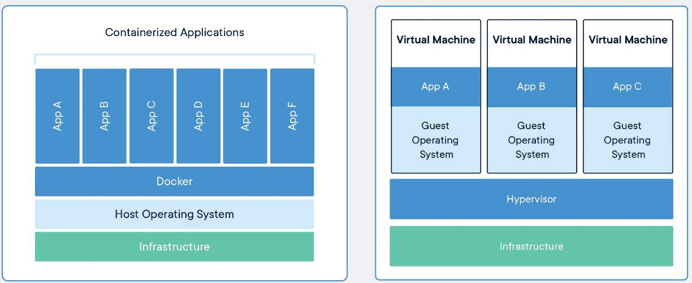

# Docker and Containerisation

This tutorial gives a brief introduction to a key element of Starling - containerisation. By the end you will hopefully have an idea of what containerisation is, what docker is, how to use it, and how we use it within Starling.

> This is adapted from the [Duckietown Docker Docs](https://docs.duckietown.org/DT19/software_devel/out/docker_intro.html), [Docker Docs tutorial](https://docs.docker.com/get-started/), and a number of other resources.

[TOC]

## Introduction

### What is Containerisation and Docker

It would be nice to give a computer - any computer with an internet connection - a short string of ASCII characters (say via a keyboard), press enter, and return to see some program running. Forget about where the program was built or what software you happened to be running at the time (this can be checked, and we can fetch the necessary dependencies). Sounds simple, right? In fact, this is an engineering task that has taken thousands of the world’s brightest developers many decades to implement.

Thanks to the magic of container technology we now can run any Linux program on almost any networked device on the planet, as is. All of the environment preparation, installation and configuration steps can be automated from start to finish. Depending on how much network bandwidth you have, it might take a while, but that’s all right. All you need to do is type the string correctly.

Docker is one very widely used example of containerisation technology, and the one we make use of in Starling. They provide a large number of tools and programs to help us contain, develop, test and deploy our containers to the real world.

If you followed the [getting started](getting_started.md), you should hopefully have done the full docker install. If not, you can run the following command from a linux command line to install basic docker.

```
 curl -sSL https://get.docker.com/ | sh
```

### Docker Concepts in more detail

> Adapted from [Docker Resources](https://www.docker.com/resources/what-container/)

A **container** is a standard unit of software that packages up code and all its dependencies so the application runs quickly and reliably from one computing environment to another. A Docker container image is a lightweight, standalone, executable package of software that includes everything needed to run an application: code, runtime, system tools, system libraries and settings.

Container **images** become containers at runtime and in the case of Docker containers – images become containers when they run on Docker Engine. Available for both Linux and Windows-based applications, containerized software will always run the same, regardless of the infrastructure. Containers isolate software from its environment and ensure that it works uniformly despite differences for instance between development and staging.

Containers are *Standard* (can run anywhere), *Lightweight* (Share low level machine system and not the whole Operating System) and *Secure* (Each application is as isolated as possible). For us this also translates to providing *Reproduceable* and *Reusable* systems.



On the left, Containers are an abstraction at the app layer that packages code and dependencies together. Multiple containers can run on the same machine and share the OS kernel with other containers, each running as isolated processes in user space. Containers take up less space than VMs (container images are typically tens of MBs in size), can handle more applications and require fewer VMs and Operating systems.

On the right, Virtual machines (VMs) are an abstraction of physical hardware turning one server into many servers. The hypervisor allows multiple VMs to run on a single machine. Each VM includes a full copy of an operating system, the application, necessary binaries and libraries – taking up tens of GBs. VMs can also be slow to boot.

## Docker in Starling

### Basics

Every docker container is registered to a developer or organisation. In Starling, our docker organisation is known as [`uobflightlabstarling`](https://hub.docker.com/orgs/uobflightlabstarling). Within our organisation, we have a large number of Docker **containers** available. These Docker containers live inside [**container registries**](https://hub.docker.com/orgs/uobflightlabstarling/repositories) (such as DockerHub), which are servers that host Docker images. A Docker **image** is one particular version or snapshot of a container and is basically a filesystem snapshot - a single file that contains everything you need to run our container.