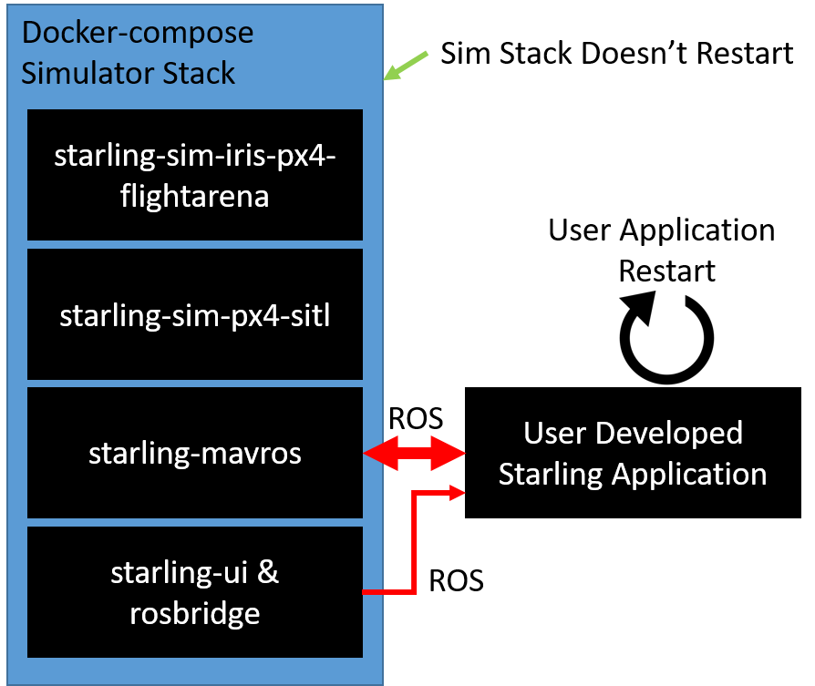
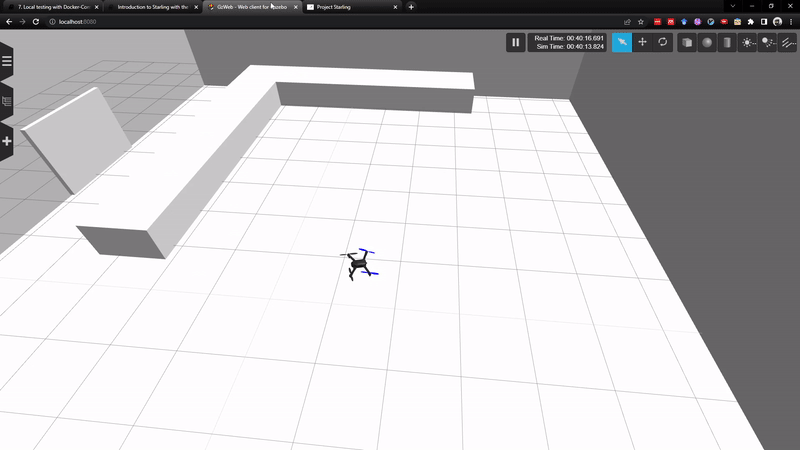

# Local Testing with Docker Compose

In this section we will see how to do local development and testing with the local simulation environment using docker-compose. This forms the first step of the Starling workflow. By the end of this tutorial, you should understand how to run your controller against the simulation containers.

[TOC]

## Running the Controller and the Simulator Together

Bringing together the previous couple of tutorials, we can run our developed controller against the simulator.

### Verify your controller

First, make sure you are in the root of your controller application. Now, let us verify that our own controller is at least compiling properly. We should get something like the following, and then stop it using `ctrl+c`:

```text
make run
...
---- controller base setup START ------------
VEHICLE_NAMESPACE not set, default to launchfile defaults
---- controller base setup END ------------
Sourcing local install setup.bash
VEHICLE_MAVLINK_SYSID not set, default to 1
Running Onboard Controller
[INFO] [launch]: All log files can be found below /root/.ros/log/2022-06-20-22-22-51-158267-9c4f7a240328-49
[INFO] [launch]: Default logging verbosity is set to INFO
[INFO] [controller-1]: process started with pid [51]
[controller-1] [INFO] [1655763771.265611400] [vehicle_1.controller]: Reset Internal Parameters and Trajectory Executor
[controller-1] [INFO] [1655763771.265749100] [vehicle_1.controller]: Controller initialised
[controller-1] [WARN] [1655763771.365796900] [vehicle_1.controller]: Waiting for vehicle state data
[controller-1] [INFO] [1655763771.365888900] [vehicle_1.controller]: Initialisation Waiting on System Checks
[controller-1] [WARN] [1655763771.465746400] [vehicle_1.controller]: Waiting for vehicle state data
...
```

> If you have syntax errors and the like, please go back and fix them before continuing, it will save you time in the long run!

The controller is currently waiting on system checks and vehicle state data. This means that it is not receiving any data from drone ros topics. Understandable as we have not yet run the simulator and connected it up!

### Connect the simulator

Similar to previously, we can run the simulation stack provided for testing:

```bash
docker-compose -f deployment/docker-compose.yml up
```

or if you have downloaded and installed the Starling CLI from Murmuration, you could also run the following (it does the same thing under the hood):

```bash
starling deploy -f deployment/docker-compose.yml start
# or to pull the images as well
starling deploy -f deployment/docker-compose.yml start --pull
```

To access the simulator, go to [`localhost:8080`](http://localhost:8080/), and to access the simple UI, go to [`localhost:3000`](http://localhost:3000/).

In order for the controller to connect to the simulator, we need to find out which **Docker network** the simulator is running on.

To view the current docker networks, in a second terminal run

```text
docker network ls
NETWORK ID     NAME                 DRIVER    SCOPE
4c2a6932e455   bridge               bridge    local
681c73eec26a   deployment_default   bridge    local
1059b63b6f59   host                 host      local
```

We are interested in the network named `<something>_default` and not named bridge and host which are Docker default networks. In our case `deployment_default` is the network created by docker compose when running the simulation stack. It should also be called `deployment_default` for you (the `<something>` is the parent folder of the docker compose file).

Then re-run (close the previously running one with CTRL+C) your controller with this new network. You can use the `NETWORK` variable from the Makefile

```text
make NETWORK=deployment_default run

...
[controller-1] [INFO] [1655765539.785786200] [vehicle_1.controller]: Initialisation Waiting on System Checks
[controller-1] [INFO] [1655765539.816086500] [vehicle_1.controller]: Initial mavros state received
[controller-1] [INFO] [1655765539.885724600] [vehicle_1.controller]: Initialisation Waiting on Mission Start
[controller-1] [INFO] [1655765539.985731000] [vehicle_1.controller]: Initialisation Waiting on Mission Start
...
```

> You could also simply specify the `--net=deployment_default` option with normal docker run

Success! It looks like the controller has received data from mavros and is currently waiting to start the mission!

To advance the mission, you can try pressing the green mission start button on the web interface. The vehicle should then indicate it is trying to take off, and you should be able to see it move in the simulator interface!


However you will notice that it gets stuck waiting for User Controller Ready. This is because it is waiting for a packet from the server with its initial location, but of course we have no server running so it never receives it!

To remedy this, you can open up another terminal in order to run the server. As mentioned previously, this can be achieved by setting the environment variable `OFFBOARD` to true using the following syntax

```text
make NETWORK=deployment_default ENV="-e OFFBOARD=true" run
```

Repeating the previous steps to start the main controller on the network, we then get the following if we follow the instructions and press the go button every time the controller asks.


Oh dear! It looks like this example is almost there, but starts flying off of the circle erratically. Hmm, how can I develop this container without having to stop and start everything...?

## Developing with the Simulator

You may have noticed that we started the simulator, and your controller seperately as two distinct elements. You didn't have to modify any config files to add in your own controller either. This is one of the great benefits of our system as this designed separation allows the recreation of your user application without having to restart the main simulator!



This holds as long as:

1. Your application has been run on the same network as the simulator
2. Your application is written in such a way that it can be attached to the simulator at any time
3. Your application hasn't put the simulator in an unrecoverable state! e.g. Flipped the vehicle upside down.

Otherwise it is quite simple to make some changes to your own application and re-run your container using `make ... run` again **without having to exit the simulator**.

> *Note:* This also applies to the terminal running the offboard node! Since its reactive, you dont need restart that either. ROS will simply patch the connection when your onboard controller is restarted.

And now finding the bug in my `smExecute` function, my controller now does what I expect it to do - fly in a circle!



## Next Steps

**Congrats!** 🥳 You hopefully now have a working and tested Starling application. With luck, you now also have a better understanding of how to use Starling and its containers to quickly develop and prototype your controllers.

However, we still have one part of the brief to go - the customer wanted a multi-drone application! In the next few tutorials we will take you through how to build, develop and test your application in a multi-drone setup which will take you closer to flying real drones at the BRL.
