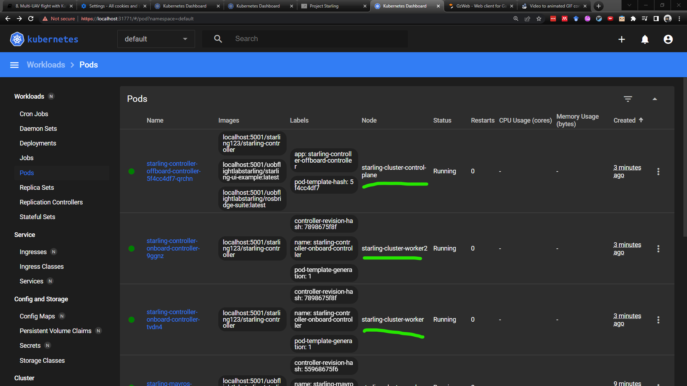
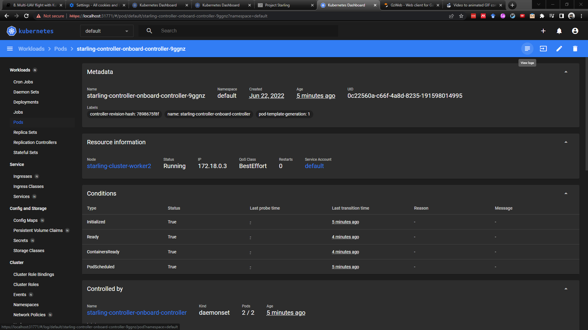
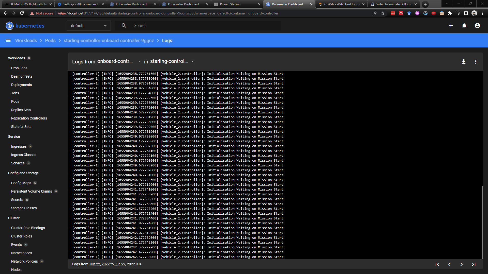
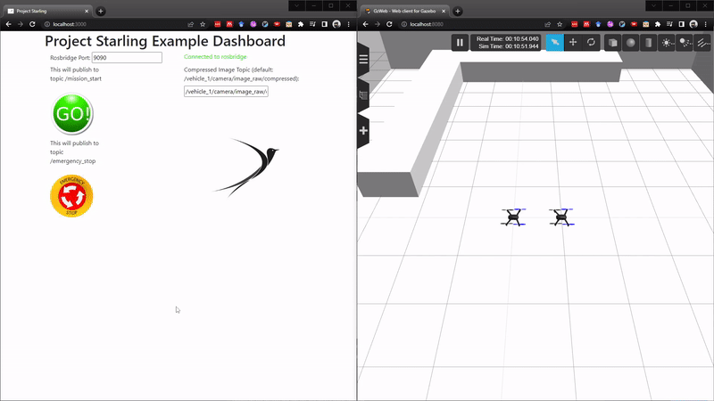
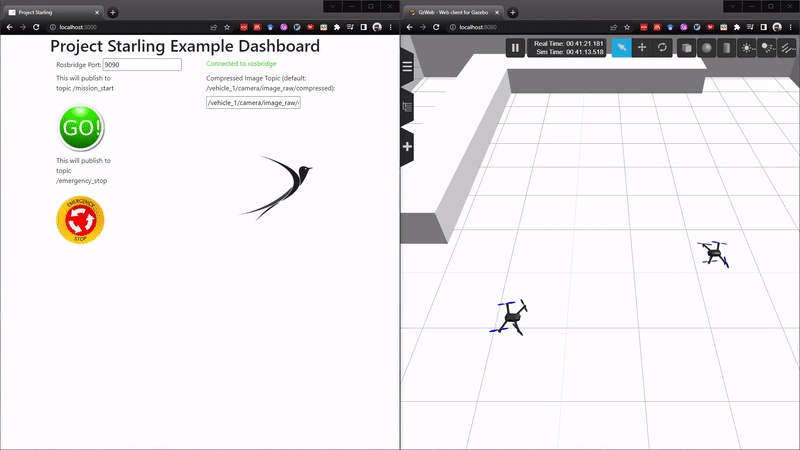

# Local Integration testing with KinD Digital Double

In this tutorial, you will finally be flying your controller against multiple vehicles within the Starling Integration Test Stack using KinD. By the end, you will understand how to develop and test against our stack, ready for flying on real vehicles.

[TOC]


## Specifying your Deployments

In your Starling application deployment folder, you should also see a `kubernetes.yaml` file. This file contains the instructions to tell Kubernetes which containers should be deployed to which places. It should be automatically generated to point to your project, so the image names here will be different to yours.

There are two configurations listed, one for the Onboard Controller, and one for the Offboard central controller, seperated by the `---`. Breaking both down together briefly:

```yaml
# Onboard controllers
apiVersion: apps/v1
kind: DaemonSet
metadata:
    ...
---
# Central monitor
apiVersion: apps/v1
kind: Deployment
metadata:
    ...
```

In Starling we primarily make use of two types of deployment: the **Deployment** and the **Daemonset**. In general we use a deployment when we want a container to be deployed to a specific place, in our case the deployment of your applications offboard component into the central server. The Daemonset on the other hand is used for deploying something to any node which matches a given label, in our case, any drone on the network.

```yaml
# Onboard Controllers
      nodeSelector:
        # starling.dev/vehicle-class: rotary
        starling.dev/type: vehicle

      tolerations:
      - key: "starling.dev/type"
        operator: "Equal"
        value: "vehicle"
        effect: "NoSchedule"
---
# Central monitor
      nodeSelector:
        name: master

      tolerations:
      - key: node-role.kubernetes.io/master
        operator: Exists
        effect: NoSchedule
```

A bit further down on each you will see the nodeSelector and tolerations. All we'll say about these is that they enable us to choose where the containers are deployed. So the onboard controller is deployed to any node with the `starling.dev/type: vehicle` label, and similarly with the `name: master` label for the central monitor.

```yaml
# Onboard Controllers
      containers:
      - name: onboard-controller
        image: starling123/starling-controller
        imagePullPolicy: Always
        volumeMounts:
            ...
---
# Central Monitor
      containers:
      - name: offboard-controller
        image: starling123/starling-controller
        imagePullPolicy: Always
        env:
          - name: OFFBOARD
            value: "true"
      - name: starling-ui
        image: uobflightlabstarling/starling-ui-example:latest
        imagePullPolicy: Always
        ports:
        - containerPort: 3000
      - name: rosbridge-suite
        image: uobflightlabstarling/rosbridge-suite:latest
        imagePullPolicy: Always
        ports:
        - containerPort: 9090
```

Here we list the container or containers that each each deployment is actually deploying. For the onboard controller, we specify the image that we have built as part of this starling project. For the offboard controller, we also specify our image, but we also add the UI into our deployment. This implies that our kubernetes Pod contains 3 images which is absolutely fine - its a good way to group together functionality. Here we want all 3 containers to be run on the central monitor, so we may as well group them. Here we also specify the ports

> *Note:* `imagePullPolicy` dictates if an image should be updated from the repository. `Always` means that on startup it will always pull the latest image to run. This is needed for local development in order to ensure you are running the latest controller. Optionally, `imagePullPolicy` can be set to `IfNotPresent` for the UI and rosbridge as they need only be pulled once.

> *Note:* see also that the onboard controller also `volumeMounts` the file `/etc/starling/vehicle.config`. This is a special file which containers running onboard a drone read to identify who they are and other useful individual information. This file exists on every drone and containers are given access to it by mounting the file into the container when running. This is part of the Starling architecture.


## Deploying your controller to KinD

### Starting the KinD stack

First things first, we need to start up the testing stack. For more details, see the [previous tutorial](multiuav_kubernetes.md). Let's start it up with two drones within the BRL environment.

```bash
# Start the kind stack
starling start kind -n 2
# Start the dashboard for visualisation. Remember to grab the key and go to https://localhost:31771
starling start dashboard
# Load the images into KinD and start the simulator
starling simulator start --brl --load
```

As usual once everything is loaded, you should be able to see the simulator on [`https://localhost:8080`](https://localhost:8080).

> *Note:* If the simulator doesn't look like it's starting within 3 or 4 minutes, you can try and restart it by using `restart` instead of `start`.

### Deploying your controller

First, ensure that you have built your controller container. Do so by running the following from the root directory:

```bash
make
```

Also ensure that the default deployment file has been set up correctly and uses your image.

Then we can start, load and deploy your controller into the testing stack with the following command:

```bash
starling deploy -f deployment/kubernetes.yaml --load start
```

It may take a minute to load, but once it's done, you should see your new deployments on the Kubernetes dashboard.



Going to the `pods` tab, you should see 3 new deployments - 2 onboard deployments, one to each drone, and 1 offboard deployment on the central node. Looking at the *Node* column, it should show that the two onboard deployments are on different KinD worker nodes. Let's check on the status of these controllers by looking at their logs. Click into one of the containers and press the `View logs` button in the top right.





It looks like the controller is ready and just waiting for start button to be pressed, so let's do it!



Oh no! Looks like the vehicles just go straight into each other and crash in a very ugly way. In the real world, this would have ended up with 2 broken drones in need of repair. These are the exact situations that integration testing is meant to catch.

> *Note:* Try and guess why they crashed, and see if you can figure out a method of solving it before we continue.

## Developing with the Multi-UAV Testing Stack

In a similar vein to testing Docker-Compose, how do we make changes and develop against the KinD simulator? Again, the simulator or the cluster itself need not be restarted. Only the specific deployments related to your controller have to be updated.

There are 3 steps involved:

1. Rebuilding your container locally using `make`.
2. Loading the updated image to the local repository so KinD has access to it.
3. Restarting the deployment.

This can be achieved in the following line:

```bash
make && starling deploy -f deployment/kubernetes.yaml --load restart
```

For the crash scenario above, this was caused by the automated numbering of the drones and how they need to move through each other to get to their assigned start locations.

A simple solution is to add a 90 degree offset to theta, so the entire circle is rotated by 90 degrees.

```cpp
// In controller.hpp around line 71, I added
const double theta_offset = M_PI/2.0;
///
// In controller.cpp line 100 inside handleNotifyVehicles(..), I added that constant to this line
// Used to be: double start_target_theta = 2 * M_PI * s->vehicle_id / s->total_vehicles;
double start_target_theta = this->theta_offset +  (2 * M_PI * s->vehicle_id / s->total_vehicles);
```

Then we run the below command to rebuild and redeploy:

```bash
make && starling deploy -f deployment/kubernetes.yaml --load restart
```

Check again to make sure the controllers have restarted (check that the created time is small). Then try pressing `Go` again!



## Next Steps

**Congrats!** 🎉🎉🎉 You now have your very own Starling application controller running within the KinD Multi-UAV Integration Testing Stack. This is literally as close as you can get from a systems perspective to flying real drones in the flight arena. If it works here, the only thing left to contend with is the differences between simulated and real vehicle flight (this is obviously a massively difficult problem, but thankfully many cleverer people are working on that...).

You should now have an idea of how to develop and test multi-UAV applications within the integration test framework, and how to deploy your own applications to it.

Feel free to further develop your applications! Maybe make them do something even more interesting than flying around in a circle (hahaha).

The final step to the Starling worflow is then to take your controller and deploy it into the real world!